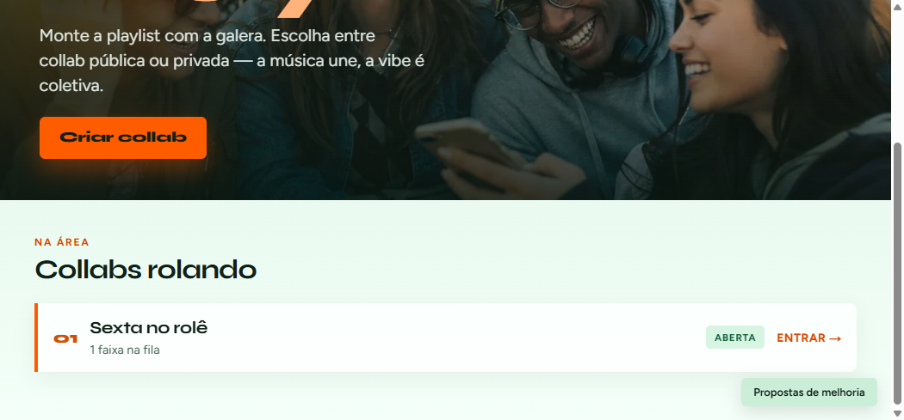
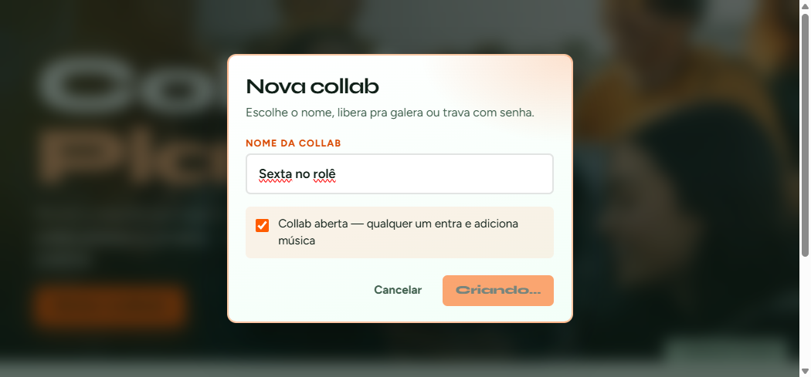
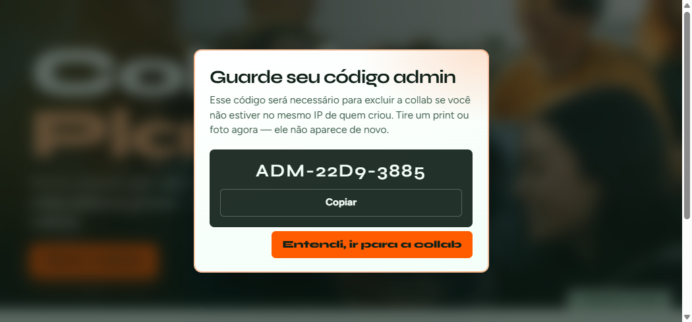
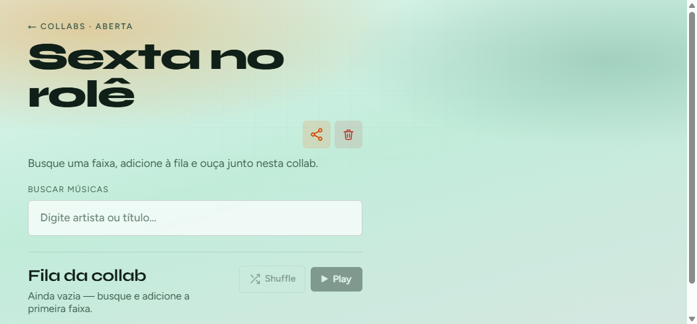
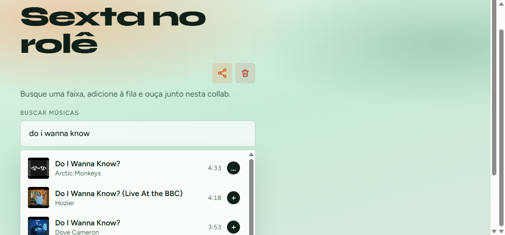
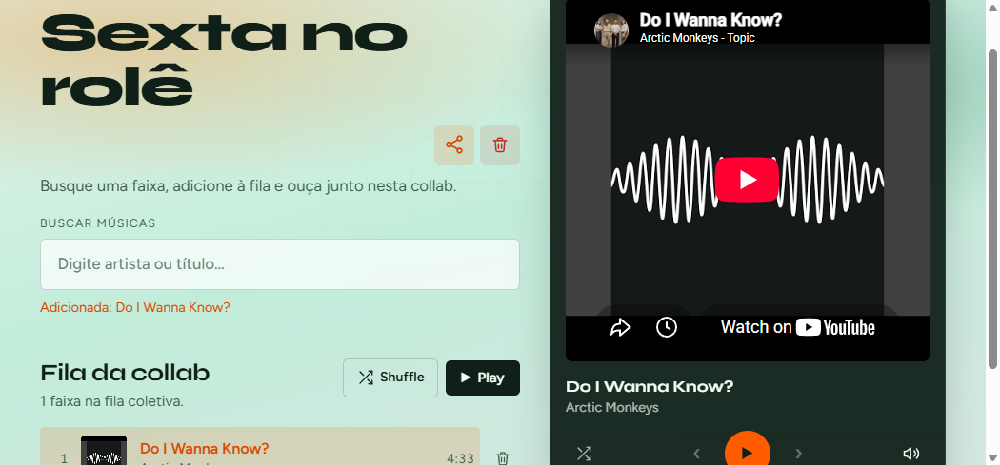

# CoLab Play

<p align="center">
  <strong>Monte a playlist com a galera.</strong><br/>
  Collabs públicas ou privadas — a música une, a vibe é coletiva.
</p>

<p align="center">
  <a href="https://colab-play.vercel.app/"></a>
  
  
</p>

<p align="center">
  <a href="https://colab-play.vercel.app/"><strong>→ Abrir a demo gratuita</strong></a>
</p>

---

## Demo ao vivo

O app está publicado e aberto para visitação:

**[https://colab-play.vercel.app/](https://colab-play.vercel.app/)**

Crie uma collab, chame a galera e toque junto — sem instalação.

---

## Telas

### Home




### Criar collab





### Sala da collab







---

## O que é

CoLab Play é uma playlist colaborativa em tempo de rolê:

- Crie collabs **abertas** ou **fechadas** (com senha)
- Busque faixas no YouTube e adicione à fila coletiva
- Player embutido com play, volume, progresso e **shuffle** (sem repetir até acabar a fila)
- Compartilhe o link da sala
- Exclua com confirmação de dono (mesmo IP) ou **código admin**
- Envie propostas de melhoria (salvas no banco)

---

## Stack

| Camada | Tecnologia |
|--------|------------|
| Frontend | Next.js 16 (App Router) + TypeScript + CSS Modules |
| Backend | Route Handlers (Node.js) |
| Banco | MongoDB + Mongoose |
| Mídia | YouTube (busca via Piped / Data API + IFrame Player) |
| Deploy | [Vercel](https://colab-play.vercel.app/) |

---

## Segurança

Medidas aplicadas contra abusos e ataques comuns:

| Proteção | Como |
|----------|------|
| **Security headers** | CSP, HSTS (prod), `X-Frame-Options`, `nosniff`, `Referrer-Policy`, `Permissions-Policy`, COOP/CORP |
| **Rate limiting** | Limite por IP em create, unlock, search, tracks, delete e propostas |
| **Payload guard** | JSON limitado (~32 KB); rejeita body inválido/grande |
| **Validação de input** | Sanitização de texto, tamanho máx., ID YouTube (`[\w-]{11}`), allowlist de capas HTTPS |
| **Senhas** | `scrypt` + salt; comparação `timingSafeEqual` |
| **Cookies de acesso** | `httpOnly`, `sameSite=lax`, `secure` em produção, validade de 7 dias |
| **Segredo de acesso** | `COLLAB_ACCESS_SECRET` obrigatório em produção |
| **Exclusão** | Dono (IP) com confirmação **ou** código admin hasheado |
| **Limites de abuso** | Máx. 200 faixas/collab; caps em senha, nome, busca e propostas |
| **IP do cliente** | Prefere headers de plataforma (`x-vercel-forwarded-for`) |

> Dica: defina um `COLLAB_ACCESS_SECRET` longo e aleatório no painel da Vercel antes do deploy.

---

## Como rodar local

```bash
npm install
npm run db:up
cp .env.example .env
# edite MONGODB_URI e COLLAB_ACCESS_SECRET
npm run dev
```

Abra [http://localhost:3000](http://localhost:3000).

### Variáveis

```env
MONGODB_URI=mongodb://127.0.0.1:27017/colabplay
COLLAB_ACCESS_SECRET=troque-por-um-segredo-longo-e-aleatorio

# Opcional — busca
PIPED_API_BASES=https://api.piped.private.coffee,https://pipedapi.reallyaweso.me
YOUTUBE_API_KEY=
```

---

## Banco

Collection `collabs`:

- `id`, `name`, `isOpen`
- `passwordHash`, `adminCodeHash`, `creatorIp`
- `createdAt`, `updatedAt`
- `tracks[]` (id YouTube, título, artista, capa, duração…)

Collection `proposals`: texto das ideias enviadas pela home.

---

## API (resumo)

| Rota | Métodos | Descrição |
|------|---------|-----------|
| `/api/collabs` | GET, POST | Lista / cria |
| `/api/collabs/[id]` | GET, DELETE | Detalhe / exclui |
| `/api/collabs/[id]/unlock` | POST | Desbloqueia collab fechada |
| `/api/collabs/[id]/tracks` | POST, DELETE | Adiciona / remove faixa |
| `/api/search?q=` | GET | Autocomplete YouTube |
| `/api/proposals` | POST | Proposta de melhoria |

---

## Fluxo rápido

1. Abra a [demo](https://colab-play.vercel.app/) ou rode local.
2. **Criar collab** → guarde o código admin (print!).
3. Busque músicas, adicione à fila e toque.
4. Ative **Shuffle** se quiser ordem aleatória sem repetir.
5. Compartilhe o link da sala com a galera.

---

## Licença

Projeto pessoal / open para visitação — use, explore e mande ideias pelo botão **Propostas de melhoria**.
